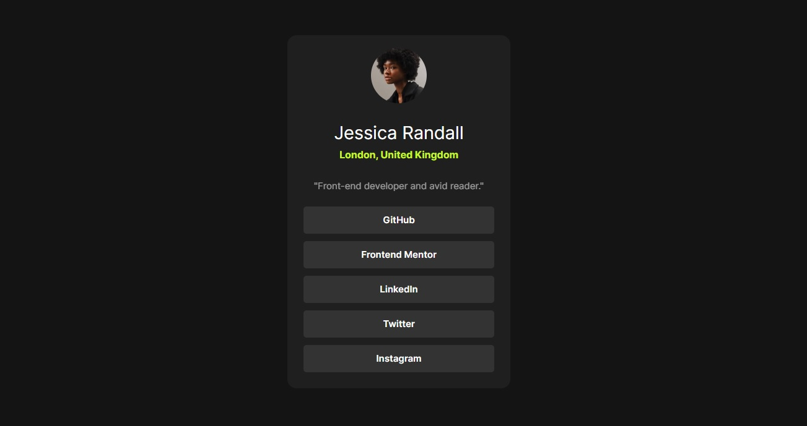

# Frontend Mentor - Social links profile solution

This is a solution to the [Social links profile challenge on Frontend Mentor](https://www.frontendmentor.io/challenges/social-links-profile-UG32l9m6dQ). Frontend Mentor challenges help you improve your coding skills by building realistic projects. This project is a simple HTML and CSS implementation for creating a social link-sharing profile. It allows users to showcase their social media links in a structured and visually appealing way.

### Frontend Mentor - Social links profile preview

## Table of contents

- [Overview](#overview)
  - [The challenge](#the-challenge)
  - [Screenshot](#screenshot)
  - [Links](#links)
- [My process](#my-process)
  - [Built with](#built-with)
  - [What I learned](#what-i-learned)
  - [Continued development](#continued-development)
  - [Useful resources](#useful-resources)
- [Author](#author)
- [Acknowledgments](#acknowledgments)

## Overview

### Features

#### Users can:

Display multiple social media links on a single profile.
See hover effects on social media icons.
View the profile on both desktop and mobile devices with a responsive design.
Screenshot

### The challenge

Users should be able to:

- See hover and focus states for all interactive elements on the page

### Screenshot

#### Desktop View 

#### Mobile View 

### Links

- Solution URL: [Code](https://github.com/julianflancheros/Social-links-profile)
- Live Site URL: [Deploy](https://julianflancheros.github.io/Social-links-profile/)

## My process

### Built with

- Semantic HTML5 markup
- CSS custom properties
- Flexbox
- CSS Grid
- Mobile-first workflow

### What I learned

During this project, I enhanced my understanding of:

Responsive web design using Flexbox and CSS Grid.
Creating a clean and structured layout using HTML and CSS.
Applying hover effects to interactive elements.

### Continued development

In the future, I plan to expand this project by:

Adding a JavaScript feature for dynamic link management.
Enhancing the design with CSS animations and transitions.
Improving the accessibility of the website.

### Useful resources

- [MDN Web Docs](https://developer.mozilla.org/es/) - A comprehensive resource for HTML, CSS, and web development.
- [CSS-Tricks](https://css-tricks.com/) - Helped me refine my understanding of Flexbox and Grid layout techniques.

## Author

- Website - [https://julianflancheros.js.org](https://julianflancheros.js.org)
- Frontend Mentor - [@julianflancheros](https://www.frontendmentor.io/profile/julianflancheros)
- Linkedin - [@Julianflancheros](https://www.linkedin.com/in/julianflancheros)

## Acknowledgments

A special thanks to the online communities that provided valuable resources and inspiration for completing this project.
